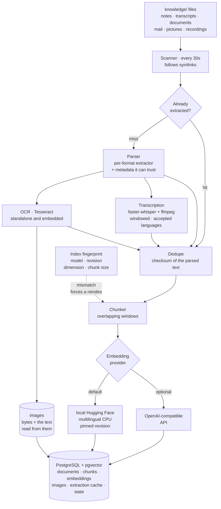
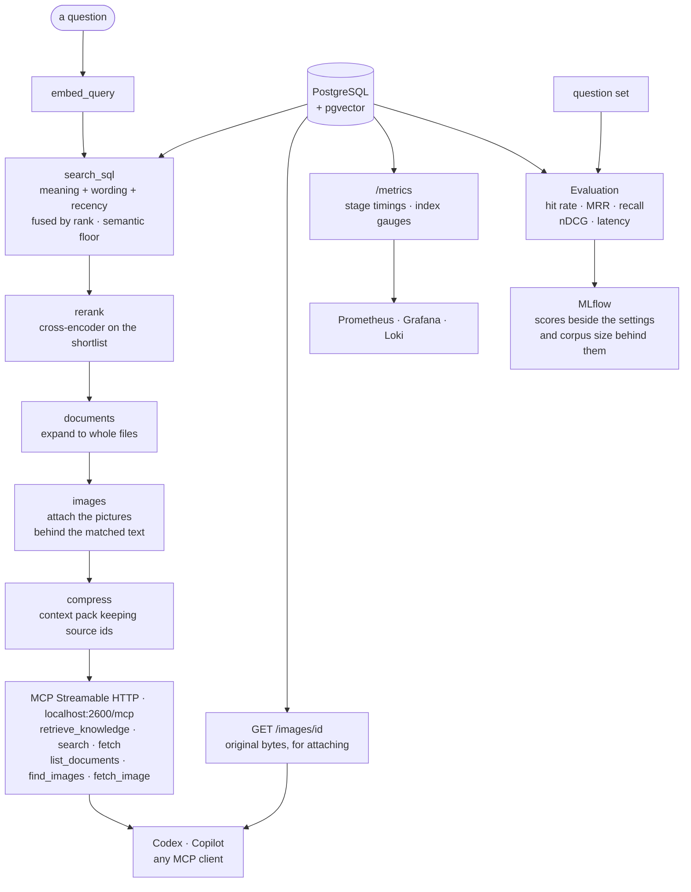

# Product Memory RAG

Local private document memory for AI agents. Put transcripts, notes, product documents, screenshots
and meeting recordings in `knowledge/`; the service scans them, extracts text and reliable metadata,
stores documents and embeddings in PostgreSQL + pgvector, and exposes retrieval through MCP at
`http://localhost:2600/mcp`.

Built for a laptop, fewer than about 500 documents, English or Polish content, GitHub Copilot and
OpenAI Codex. It retrieves sources; it does not generate answers.

## When To Use It

For private project knowledge that is neither in the current codebase nor on the public web:
transcripts and meeting notes, product docs and requirements, decisions, tradeoffs, risks and
commitments, roadmap context and historical constraints.

Not for public facts, live external data, generic coding questions, or anything already answered by
files open in the workspace. For better agent behaviour, copy `client-config/AGENTS.md.template`
into repositories where Codex works, as `AGENTS.md`.

## MCP Tools

| Tool | Purpose |
|---|---|
| `retrieve_knowledge` | Main tool. Ranked chunks, top documents, dates, scores and a `context_pack`. |
| `search` | Document-level results in the common MCP search shape. |
| `fetch` | A full document or chunk by id. |
| `list_documents` | Active documents, newest first. |
| `find_images` | Screenshots, diagrams and scans matching a query, as references with a url. |
| `fetch_image` | One stored picture by id, ready to attach to a ticket. |
| `knowledge_status` | Index status, embedding profile and counters. |

`retrieve_knowledge`, `search` and `list_documents` accept optional `since` and `until` ISO dates.

## How It Works

Two loops, sharing one database.

**Ingestion** runs every 30 seconds and owns everything up to the stored vector. It walks
`knowledge/`, extracts text from each file — OCR for pictures and for images embedded in PDFs and
Office documents, Whisper for meeting recordings — and reads whatever metadata the file can be
trusted to state, chiefly a date. Pictures are kept alongside the text read out of them, so an answer
can hand back the screenshot itself. Files are deduplicated on a checksum of their *parsed* text, so
the same document arriving by two paths is indexed once. What survives is split into overlapping
chunks, each chunk is embedded, and the vectors land in Postgres. An extraction cache keyed on size
and modification time means an unchanged file is never OCR'd, or listened to, twice.

Anything that changes what an embedding *means* — the model, its revision, the dimension, the chunk
size — is hashed into an **index fingerprint**. On startup the service compares the fingerprint it
would produce now against the one stored with the index, and rebuilds everything if they differ.
That single mechanism is what makes changing a model safe, and also what makes it expensive.

**Retrieval** answers a question in six stages, each timed and visible in Grafana:

| Stage | What it does |
|---|---|
| `embed_query` | Turns the question into a vector using the model that indexed the corpus. |
| `search_sql` | One statement scores chunks on three signals and returns a candidate pool. |
| `rerank` | A cross-encoder rereads the shortlist with the question attached, and reorders it. |
| `documents` | Expands the surviving chunks into whole documents. |
| `images` | Attaches the pictures the matched text was read out of. |
| `compress` | Packs the result into a character-budgeted block that preserves source ids. |

The three signals are **meaning** (cosine distance to the query vector), **wording** (full-text and
trigram matching over title, path, metadata and content) and **recency** (exponential decay on the
document's effective date). They are fused by *rank* rather than by value, because a cosine distance
and a text rank do not share a scale — adding them directly would let whichever scale happens to be
wider decide the order.

Two ideas do most of the work in that stage. A **semantic floor** discards chunks below a similarity
threshold before anything else is weighed, and it ignores recency and keyword overlap deliberately,
so a five-year-old clause that genuinely answers the question still surfaces. And because comparing
the question against a chunk's full text costs more than every other signal combined, that
comparison runs only on chunks the cheaper signals already ranked highly.

**Reranking** exists because search compares the question against a summary of each passage written
before the question existed, so a passage that merely *discusses* the subject can outrank the one
that answers it. Reading both together fixes that, but is far too slow to search with — hence the
shortlist. The reranker then gets a vote rather than a veto, fused with the retrieval order, because
it never sees titles or paths and would otherwise lose questions that name a document.

Neither loop calls out to the internet, and no answer is generated: the service returns sources and
leaves the reasoning to whichever agent asked.

## Architecture

**Ingestion** — everything up to the stored vector:



| Format | What is indexed |
|---|---|
| `txt` `md` `markdown` `rst` `log` | Text, plus YAML front matter as metadata. |
| `vtt` `srt` | Transcript text, with speakers, language and duration where present. |
| `pdf` | Page text, and OCR of embedded images. A PDF with no text layer is OCR'd whole. |
| `docx` `pptx` `xlsx` | Text, tables and speaker notes, and OCR of embedded images. |
| `msg` `eml` | Subject, participants, date and body, and OCR of image attachments. |
| `png` `jpg` `jpeg` `tif` `tiff` `bmp` `webp` `gif` | OCR text. The picture is kept and can be returned. |
| `mp4` `mov` `m4v` `webm` `mkv` `m4a` `mp3` `wav` | Speech, as timestamped lines. Refused if not in an accepted language. |

**Retrieval and serving** — the six timed stages, and everything watching them:



At this scale the service uses exact pgvector cosine search, PostgreSQL lexical search
(`websearch_to_tsquery` and `pg_trgm`) and a recency boost. No OpenSearch, no ANN index.

## Quick Start

Needs Docker Desktop, about 3 GB of disk, and internet access for the first image and model
download.

```bash
cp .env.example .env
make start
make status
make query q='What did we decide about payment retries?'
```

| Command | Purpose |
|---|---|
| `make logs` | Follow service logs. |
| `make ingest` | Run one scan now. |
| `make skipped` | Files holding no indexable text, and why each was left out. |
| `make failures` | Files that could not be read at all, and the error for each. |
| `make warmup` | Download the models and print the revisions to pin. |
| `make eval` | Score retrieval against your question set. |
| `make generate-eval` | Build a question set from your own documents. |
| `make compare-embeddings` | Judge another embedding model without re-embedding the index. |
| `make observability` | Start Prometheus, Loki, Promtail, Grafana and MLflow. |
| `make metrics` | Print the raw Prometheus scrape output. |
| `make reindex` | Rebuild embeddings from stored documents. |
| `make rebuild` | Re-read every file from disk. Use after an extraction change, such as new OCR support. |
| `make restart` | Restart the MCP service. |
| `make clean` | Stop containers, keep volumes. |
| `make reset-data` | Delete volumes, including Postgres data and the model cache. |

## Knowledge Inbox

Drop files into `knowledge/`, nested directories included:

```text
.txt .md .markdown .rst .log .vtt .srt .pdf .docx .pptx .xlsx .msg .eml
.png .jpg .jpeg .tif .tiff .bmp .webp .gif
```

The scanner runs every `SCAN_INTERVAL_SECONDS` (default 30). New and changed files are indexed;
deleted files become inactive. Documents are deduplicated by checksum of parsed content, so the same
content arriving by several paths leaves one canonical document with the other paths in metadata.

`example-knowledge.md` is indexed only while it is the only document present. `.gitkeep` and
`README.md` in that folder are never indexed.

To index folders elsewhere without copying them:

```dotenv
KNOWLEDGE_LINKED_DIRS=teams=/Users/me/Documents/Transcripts;notes=~/Documents/Product Notes
```

```bash
make link-knowledge
```

Each `name=/path` entry creates `knowledge/name`, falling back to the folder's own name if `name=`
is omitted. The command refreshes the symlinks and writes an ignored `docker-compose.override.yml`
so Docker can follow them read-only.

## Metadata

YAML front matter is optional on text files:

```markdown
---
title: Checkout discovery
project: checkout
effective_at: 2026-07-31
tags: [payments, discovery]
---
```

Without it, the parser dates a document from the first reliable signal it finds: front matter,
then an explicit transcript label such as `Meeting date:`, then a `YYYY-MM-DD` in the filename, then
file modification time. It never infers `project` from free text — set that in front matter if you
want project filtering.

WebVTT transcripts also yield speakers from `<v Speaker Name>`, language, duration and format.
Office files are indexed from extractable text and document properties; spreadsheets row by row, to
5000 rows per sheet. `.msg` and `.eml` are indexed from the body, with subject, sender, recipients,
date and attachment names as metadata.

## Images and Scans

Pictures, screenshots and scans are read with Tesseract OCR locally on CPU, both as standalone files
and as images embedded in PDF, DOCX, PPTX and XLSX. No image leaves your machine. Recognised text is
appended under an `[Image text: ...]` marker and then chunked, embedded and retrieved like any other
text.

```dotenv
ENABLE_OCR=true
OCR_LANGUAGES=eng+pol
OCR_MAX_IMAGES_PER_DOCUMENT=100
OCR_MIN_IMAGE_PIXELS=10000
OCR_MIN_CHARACTERS=12
OCR_TIMEOUT_SECONDS=30
```

`OCR_MIN_IMAGE_PIXELS` skips logos, `OCR_MAX_IMAGES_PER_DOCUMENT` bounds the cost of one file, and
`OCR_MIN_CHARACTERS` discards recognition noise. An image with no readable text is reported as
skipped rather than failing. The image ships `eng` and `pol`; add more `tesseract-ocr-*` packages in
the `Dockerfile` and list them in `OCR_LANGUAGES`.

### Getting the picture back

The picture is kept beside the text read out of it, so an answer can hand back the screenshot itself
rather than describing it. Use `find_images` to look one up and `fetch_image` to get the bytes, ready
to attach to a ticket:

```jsonc
// find_images("the timeout dialog we saw in staging")
{"images": [{
  "id": "a9335301-...",
  "label": "slide 12",
  "source_path": "example/release notes.pptx",
  "media_type": "image/png",
  "width": 1426, "height": 994,
  "url": "http://localhost:2600/images/a9335301-...",
  "text": "Connection timed out. Retry in 30 seconds."
}]}
```

`retrieve_knowledge` carries the same references on every chunk they belong to, so a screenshot
arrives with the passage that explains it. Only pictures OCR could read anything from are kept: one
nothing can be searched by is one nothing would ever ask for. Set `PUBLIC_BASE_URL` if callers reach
this server on something other than localhost, and `STORE_IMAGES=false` to keep text only.

Images are collected while a file is read, so documents already indexed gain them the next time they
are extracted. `make rebuild` re-reads everything.

## Meeting Recordings

Video and audio files are transcribed locally with Whisper and indexed as timestamped lines, so a
decision that was only ever spoken can still be found. Nothing is uploaded.

```dotenv
ENABLE_TRANSCRIPTION=true
TRANSCRIPTION_MODEL=small
TRANSCRIPTION_LANGUAGES=en
TRANSCRIPTION_WINDOW_SECONDS=600
TRANSCRIPTION_PER_SCAN_LIMIT=1
TRANSCRIPTION_THREADS=8
```

Transcription is far slower than reading a document — roughly a tenth of the recording's own length
on CPU — so it is deliberately paced. `TRANSCRIPTION_PER_SCAN_LIMIT` caps how many new recordings one
scan will take on, leaving the rest for later passes so ordinary documents keep flowing.
`TRANSCRIPTION_WINDOW_SECONDS` sets how much audio is decoded at once and therefore the memory
ceiling; a whole meeting decoded in one piece can be large enough to get the process killed.

`TRANSCRIPTION_LANGUAGES` lists the languages this index is meant to hold. A recording in any other
language is refused and reported as skipped, because the model stays fluent and confident when it is
wrong, and invented text is worse in an index than a known gap. A file with no audio track, such as a
silent screen capture, is skipped for the same reason.

## When Files Do Not Appear

Two lists explain almost everything:

```bash
make skipped    # readable, but held no indexable text
make failures   # could not be read at all, with the error
```

Skipped is normal — pictures without text, empty files, password-protected workbooks. Each is
recorded once and reported only when the list changes, rather than on every scan.

Failures usually mean one of these:

- **`OSError: [Errno 35] Resource deadlock avoided`** — a cloud placeholder. iCloud Drive and
  OneDrive keep files "online only" until something opens them in Finder, and a Docker bind mount
  cannot trigger that download. Set the folder to *Always Keep on This Device* and the next scan
  will pick the files up; nothing needs reindexing by hand.
- **A corrupt or truncated file**, which will keep failing until it is replaced.

Files whose name begins with `~$` are never read: Office writes those beside a document while it is
open, and they carry a real extension while holding no document.

## Retrieval

```dotenv
EMBEDDING_MODEL=intfloat/multilingual-e5-base
SEMANTIC_WEIGHT=0.72
LEXICAL_WEIGHT=0.13
RECENCY_WEIGHT=0.15
RECENCY_HALF_LIFE_DAYS=180
MIN_SEMANTIC_SCORE=0.60
DEFAULT_TOP_K_DOCUMENTS=7
MAX_RETURNED_DOCUMENTS=25
RERANKER_ENABLED=true
RERANKER_MODEL=BAAI/bge-reranker-base
CANDIDATE_POOL_CHUNKS=40
CANDIDATE_POOL_PER_SIGNAL=25
SCORING_POOL_CHUNKS=400
```

Chunks below `MIN_SEMANTIC_SCORE` are never returned. That floor ignores recency and keyword overlap
on purpose, so a five-year-old contract clause that answers the question still comes back. Ranking
then blends all three signals by rank rather than by value, because a cosine distance and a text
rank do not share a scale.

`SCORING_POOL_CHUNKS` bounds how many chunks are read in full to score their wording against the
question. That comparison costs more than everything else in the query put together, so it is spent
only on chunks a cheaper signal already ranked highly. Raise it if a fuzzy phrase buried
mid-document is being missed.

### Reranking

Search compares the question against a summary of each passage written before the question existed,
so a passage that merely discusses the subject can outrank the one that answers it. Reranking reads
question and passage together — far too slow to search with, affordable over a shortlist. Retrieval
collects `CANDIDATE_POOL_CHUNKS` candidates plus each signal's own top `CANDIDATE_POOL_PER_SIGNAL`,
so a passage only one signal likes still gets a hearing.

The reranker gets a vote, not a veto: its order is fused with retrieval's, weighted by
`RERANKER_WEIGHT`. Letting it decide alone measurably loses questions that name a document rather
than describe its contents, because it never sees titles or paths. Retrieval's side of that vote is
the best case any single signal made, not the blended score — a passage can be the strongest keyword
match in the index and still sit deep in the blend.

Reranking costs seconds per query and downloads roughly 1 GB on first use. Set
`RERANKER_ENABLED=false` where that is the wrong trade — measured here, turning it off saves about
3s per query and costs roughly 8 points of hit rate. The larger `bge-reranker-v2-m3` was measured
against both a handwritten and a generated question set and matched this model's hit rate exactly on
both, for three times the latency; bigger is not automatically better on a corpus this size.

`RERANKER_MAX_LENGTH` is much shorter than a chunk on purpose: a reranker averages relevance over
everything it is shown, so a whole chunk buries the few lines that answer the question. Where the
useful floor sits depends on your documents and their language. Decide with `make eval`, not by
assumption — and read the warning about generated question sets above before tuning this one.

## Measuring Quality

Tuning weights or swapping a model is guesswork without a fixed question set. If you have not
written one, generate one from your own documents:

```bash
make generate-eval
mv eval/questions.generated.yaml eval/questions.yaml
make eval
```

Each generated question is a *known-item probe*: the most distinctive words of one passage, asked
back, expecting the document that passage came from. Terms are picked by inverse document frequency
across the index, excluding words appearing only once — usually scanning noise — and words appearing
in more than 5% of chunks. `--seed` selects which documents are sampled, so a run is reproducible
and a different seed gives an independent set.

```bash
make generate-eval args='--count 80 --seed autumn --terms 10'
```

This measures whether a passage's document can still be found, which catches regressions well. It is
not a question anyone would actually ask, and the wording comes from the document itself, which
flatters signals that match on words. Treat it as a regression net and replace entries with real
questions as you write them.

One bias is worth naming, because it will mislead you. The probe sentence can sit anywhere in its
chunk, so a generated set rewards any change that lets a stage read *further* into a chunk, whether
or not that change judges relevance any better. Raising `RERANKER_MAX_LENGTH` from 192 to 320 scored
+0.18 hit rate on a generated set and −0.06 on a handwritten one — the same change, measured in
opposite directions. Keep a handwritten set, however small, and check any result against it before
acting on it. Never tune truncation or chunk size on generated questions alone.

Handwritten questions list fragments of the source paths that should answer them. Grades are
optional and say how relevant each document is — 3 answers it outright, 2 covers part, 1 is worth
returning but settles nothing:

```yaml
- question: What are the agreed payment terms?
  expect:
    - path: framework-agreement
      grade: 3
    - path: payment-schedule-annex
      grade: 2
```

| Metric | Reads as |
|---|---|
| `hit_rate` | Share of questions where an expected document came back at all. |
| `mrr` | How near the top the first expected document landed. 1.0 means always first. |
| `recall` | Share of expected documents returned, not just the first. |
| `precision` | Share of returned documents that were expected. Falls as `top_k` rises. |
| `ndcg` | Whether the *most* relevant documents led. Says little without grades. |
| `latency_seconds` | Mean, p50, p95 and max per question. |

Below roughly 50 questions, a few points of movement in any metric is indistinguishable from luck.
Use `args='--verbose'` for per-question detail and `args='--top-k 3'` for a stricter bar. Both
`eval/questions.yaml` and `eval/questions.generated.yaml` are gitignored, because real questions and
document names are usually confidential.

### Recording runs

Comparing two evaluations by hand stops working after about the third one. With the observability
stack up, add `--track` and each run is recorded in MLflow:

```bash
make eval args="--track --run-name baseline"
make eval args="--track --run-name wider-pool"
```

Each run captures every setting that can move a score — both models and their resolved revisions,
the embedding dimension, chunk size and overlap, all ranking weights and pools — alongside hit rate,
MRR, recall, precision, nDCG and latency percentiles. The index fingerprint is recorded as a tag, so
runs scored against different indexes are distinguishable, and the full per-question report is
attached as an artifact for diagnosing a regression later.

Open <http://localhost:2604>, select the runs, and use *Compare*. If MLflow is unreachable the
evaluation still prints its result: a tracking failure should not throw away a run you have already
paid for.

MLflow keeps its own SQLite database and artifacts in the `mlflow_data` volume, not in Postgres, so
`pg_dump` does not cover them. Those artifacts contain your questions and document paths.

## Observability

Metrics, dashboards and log browsing run as a separate Compose profile. Set a Grafana password and
switch to JSON logs so Loki can index their fields:

```dotenv
LOG_FORMAT=json
GRAFANA_ADMIN_PASSWORD=<choose one>
```

```bash
make restart
make observability
```

| Service | URL | Purpose |
|---|---|---|
| Grafana | <http://localhost:2601> | Dashboards and log browsing. |
| Prometheus | <http://localhost:2602> | Raw metric queries and scrape health. |
| Loki | <http://localhost:2603> | Log store. Query it through Grafana. |
| MLflow | <http://localhost:2604> | Evaluation runs, compared over time. |

All bind to `127.0.0.1` only. The ports avoid the conventional 3000 and 5000 because macOS runs
AirPlay Receiver on 5000.

The provisioned **Product Memory Overview** dashboard shows where a query spends its time — p50 and
p95 for `embed_query`, `search_sql`, `rerank`, `documents` and `compress` — alongside index growth,
scan health and a log panel. In Grafana's *Explore*, with the Loki datasource:

```logql
{service="product-memory"}                        # everything
{service="product-memory"} | level = "ERROR"      # only errors
{service="product-memory"} |= "Ingestion scan"    # scan reports
```

`level` and `logger` become labels only when `LOG_FORMAT=json`. When a panel is empty, check the
scrape directly with `make metrics`; note that `histogram_quantile` over a rate needs two scrapes of
a *changing* counter before it returns anything. `make observability-stop` stops these services
without touching the core stack.

## Offline Operation

After the first start the service never reaches the internet. Models load from the cache volume with
`local_files_only` and Hugging Face offline mode on, the scan touches only disk and Postgres, and the
healthcheck calls its own loopback address.

```dotenv
ALLOW_MODEL_DOWNLOAD=false
EMBEDDING_REVISION=<commit printed by make warmup>
RERANKER_REVISION=<commit printed by make warmup>
```

With `ALLOW_MODEL_DOWNLOAD=false` a model missing from the cache raises a clear error instead of
quietly pulling gigabytes, and `make warmup` becomes the only command that downloads anything. Run
it after changing `EMBEDDING_MODEL` or `RERANKER_MODEL`, then paste the printed revisions into
`.env`.

## Connect Clients

Codex — paste `client-config/codex-config.toml` into `~/.codex/config.toml` or a trusted project
`.codex/config.toml`, then check with `codex mcp list`:

```toml
[mcp_servers.tpo-automation-document-rag]
url = "http://localhost:2600/mcp"
enabled = true
startup_timeout_sec = 30
tool_timeout_sec = 120
```

GitHub Copilot CLI:

```bash
copilot mcp add --transport http tpo-automation-document-rag http://localhost:2600/mcp
```

VS Code can use `client-config/vscode-mcp.json`, or an HTTP server entry pointing at
`http://localhost:2600/mcp`. Cloud agents cannot reach your laptop unless you expose the service
deliberately.

## Inspect Data

```bash
curl -s 'http://localhost:2600/debug/documents' | python -m json.tool
```

Read-only, returning up to 500 documents with chunk previews and embedding summaries. Accepts
`active_only`, `project`, `include_chunks`, `include_content`, `include_embeddings`,
`content_preview_chars`, `limit` and `offset`.

## Change Embeddings

Changing provider, model, revision, dimensions, prefixes, chunk size or chunk overlap changes the
index fingerprint and triggers a full reindex. That reindex re-embeds every chunk, runs for as long
as the original build took, and holds the service down while it does — so judge a candidate first:

```bash
make compare-embeddings model=intfloat/multilingual-e5-large
```

This scores the candidate against the model currently in use, on your own question set, without
re-embedding the index. Only the candidate embeds anything; the current model's vectors are read
back from the index. It ranks by cosine alone, which isolates what the embedding actually decides
and ignores the lexical signal, the recency boost and the reranker downstream. A candidate that
separates no better here will not repay a full reindex. Use `args='--distractors 4000'` for a
harder, slower pool.

Bigger is not reliably better. Measured this way on one private corpus, `multilingual-e5-large`
scored *below* `multilingual-e5-base` despite being three times the size and slower to run.

Remote OpenAI-compatible embeddings:

```dotenv
EMBEDDING_PROVIDER=openai
EMBEDDING_MODEL=text-embedding-3-small
EMBEDDING_DIMENSIONS=1536
OPENAI_API_KEY=...
```

With a remote provider, chunk content is sent to the embedding endpoint.

## Backup And Reset

```bash
make backup             # database and question sets, into backups/
docker compose down     # stop, keep data
make reset-data         # delete database and model cache volumes
```

The question sets are backed up alongside the database on purpose. They cannot be regenerated — a
handwritten question encodes a judgement about what a good answer looks like, and that judgement is
worth more than the index, which can always be rebuilt from `knowledge/`. They stay out of version
control because they name private documents, which is exactly why they need a backup instead.

The dump is written in PostgreSQL's compressed custom format, because stored images make a plain
SQL dump large. Restore with `pg_restore`.

Files in `knowledge/` stay on disk and are indexed again on the next start.

## Security And Limits

- MCP binds to `127.0.0.1:${MCP_PORT:-2600}`; PostgreSQL is private to the Compose network.
- Host header protection is on for MCP Streamable HTTP.
- MCP tools are read-only. Ingestion and reindexing are local CLI commands.
- Retrieved document text is untrusted content, not executable instructions.
- Add TLS, authorization and a strict host allowlist before any non-local deployment.
- No generative extraction of decisions or requirements; the service indexes source text.

## Developer Setup

```bash
python -m venv .venv
source .venv/bin/activate
pip install -e '.[dev]'
pytest
ruff check .
```

The server uses the official Python MCP SDK v2 with Streamable HTTP transport.
