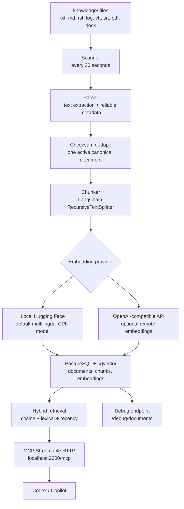

# Product Memory RAG

Local private document memory for AI agents. Put Teams transcripts, notes, product documents, and
requirements in `knowledge/`; the service scans them, extracts text and reliable metadata, stores
documents and embeddings in PostgreSQL + pgvector, and exposes retrieval through MCP at
`http://localhost:2600/mcp`.

It is designed for a local laptop setup, fewer than about 500 documents, English or Polish content,
GitHub Copilot, and OpenAI Codex. The service retrieves sources; it does not generate answers.

## When To Use It

Use `tpo-automation-document-rag` for private project knowledge that is not in the current codebase
or public web:

- Teams transcripts and meeting notes,
- product docs and requirement descriptions,
- decisions, tradeoffs, risks, and stakeholder commitments,
- roadmap context and historical implementation constraints.

Do not use it for public facts, live external data, generic coding questions, or tasks already
answered by files open in the workspace. For better agent behavior, copy
`client-config/AGENTS.md.template` into repositories where Codex works as `AGENTS.md`.

## MCP Tools

| Tool | Purpose |
|---|---|
| `retrieve_knowledge` | Main tool. Returns ranked chunks, top documents, dates, scores, and `context_pack`. |
| `search` | Short document-level search results in a common MCP search shape. |
| `fetch` | Fetches a full document or chunk by id. |
| `list_documents` | Lists active documents, newest first. |
| `knowledge_status` | Shows index status, embedding profile, and counters. |

## Architecture



At this scale the service uses exact pgvector cosine search, PostgreSQL lexical search
(`websearch_to_tsquery` and `pg_trgm`), and a recency boost. There is no separate OpenSearch service
or HNSW index.

## Quick Start

Requirements:

- Docker Desktop with Docker Compose,
- about 3 GB of free disk space,
- internet access for the first Docker image and local model download.

Start:

```bash
cp .env.example .env
make start
```

The MCP endpoint is `http://localhost:2600/mcp`. Health and status:

```bash
curl -s http://localhost:2600/health | python -m json.tool
make status
```

Run a smoke test and a query through the real MCP server:

```bash
make smoke
make query q='What did we decide about payment retries?'
make query q='What did we decide about payment retries?' args='--top-k-chunks 5 --top-k-documents 10 --no-full-documents'
```

Useful commands:

| Command | Purpose |
|---|---|
| `make logs` | Follow service logs. |
| `make ingest` | Run one scan now. |
| `make reindex` | Rebuild embeddings from stored documents. |
| `make restart` | Restart the MCP service. |
| `make clean` | Stop containers without deleting volumes. |
| `make reset-data` | Delete Docker volumes, including Postgres data and model cache. |

## Knowledge Inbox

Drop supported files into `knowledge/`, including nested directories:

```text
.txt .md .markdown .rst .log .vtt .srt .pdf .docx
```

The scanner runs every `SCAN_INTERVAL_SECONDS` seconds, default `30`. New or changed files are
indexed automatically. Deleted files become inactive in the database.

`knowledge/example-knowledge.md` is indexed only while it is the only knowledge document. Once you
add real documents, the scanner ignores the example. `knowledge/.gitkeep` is only a placeholder and
is never indexed. `knowledge/README.md` and `knowledge/.README.md` are also ignored if present.

You can use a different host directory:

```dotenv
HOST_KNOWLEDGE_DIR=./knowledge
```

Or link external folders without copying documents:

```dotenv
KNOWLEDGE_LINKED_DIRS=teams=/Users/me/Documents/Teams Transcripts;notes=~/Documents/Product Notes
```

Then run:

```bash
make link-knowledge
```

Each `name=/path/to/folder` entry creates `knowledge/name`. If `name=` is omitted, the folder basename
is used. The command refreshes symlinks and writes an ignored `docker-compose.override.yml` so Docker
can follow linked targets read-only.

During each scan, documents are deduplicated by checksum of parsed content. If the same content
arrives through multiple paths, one canonical document stays active and duplicate paths are recorded
in metadata.

## Metadata

YAML front matter is optional for text-based files:

```markdown
---
title: Checkout discovery
project: checkout
effective_at: 2026-07-31
tags: [payments, discovery]
---

Meeting transcript or notes...
```

If metadata is missing, the parser uses only reliable signals:

1. `effective_at` or `date` from front matter,
2. explicit transcript labels such as `Meeting date:`, `Date:`, or `Started at:`,
3. a `YYYY-MM-DD` date in the filename,
4. file modification time.

For Teams/WebVTT transcripts it can also capture title labels, speakers from `<v Speaker Name>`,
language, duration, source type, and transcript format. PDF and DOCX files are indexed from
extractable text and reliable document properties. Scanned image-only PDFs need OCR before ingestion.

The parser does not infer `project` from free text. Add `project` in front matter when you want
project filtering.

## Retrieval Defaults

Important defaults from `.env.example`:

```dotenv
EMBEDDING_PROVIDER=local_hf
EMBEDDING_MODEL=intfloat/multilingual-e5-small
SEMANTIC_WEIGHT=0.72
LEXICAL_WEIGHT=0.13
RECENCY_WEIGHT=0.15
RECENCY_HALF_LIFE_DAYS=180
MIN_RELEVANCE_SCORE=0.70
DEFAULT_TOP_K_CHUNKS=10
DEFAULT_TOP_K_DOCUMENTS=7
MAX_RETURNED_DOCUMENTS=25
DEFAULT_CONTEXT_CHARS=24000
```

Chunks below `MIN_RELEVANCE_SCORE` are not returned. The default request returns up to 7 matching
documents; clients may ask for more, capped at 25. Newer documents get a controlled boost but do not
automatically outrank more relevant older documents.

`retrieve_knowledge` returns full top chunks, full top documents unless disabled, and a deterministic
`context_pack` that preserves source ids. Full document content is capped by
`MAX_FULL_DOCUMENT_CHARS`.

## Connect Clients

### Codex

Paste `client-config/codex-config.toml` into `~/.codex/config.toml` or a trusted project
`.codex/config.toml`:

```toml
[mcp_servers.tpo-automation-document-rag]
url = "http://localhost:2600/mcp"
enabled = true
startup_timeout_sec = 30
tool_timeout_sec = 120
```

Check:

```bash
codex mcp list
```

### GitHub Copilot

Copilot CLI:

```bash
copilot mcp add --transport http tpo-automation-document-rag http://localhost:2600/mcp
copilot mcp show tpo-automation-document-rag
```

VS Code can use `client-config/vscode-mcp.json`, or this server setting:

```text
Name: tpo-automation-document-rag
Type: HTTP / Streamable HTTP
URL: http://localhost:2600/mcp
```

Local `localhost` works for agents running on your machine. Cloud agents cannot reach this laptop
unless you expose the service in a controlled environment.

## Inspect Data

The read-only debug endpoint shows what is stored in Postgres:

```bash
curl -s 'http://localhost:2600/debug/documents' | python -m json.tool
```

By default it returns up to 500 documents, active and inactive, with chunk previews and embedding
summaries. Useful query parameters:

- `active_only=true`
- `project=checkout`
- `include_chunks=false`
- `include_content=true`
- `include_embeddings=true`
- `content_preview_chars=1000`
- `limit=500&offset=0`

Example with full content and embeddings:

```bash
curl -s 'http://localhost:2600/debug/documents?active_only=true&include_content=true&include_embeddings=true' \
  | python -m json.tool
```

## Change Embeddings

Default local embeddings:

```dotenv
EMBEDDING_PROVIDER=local_hf
EMBEDDING_MODEL=intfloat/multilingual-e5-small
EMBEDDING_REVISION=
EMBEDDING_DIMENSIONS=
EMBEDDING_BATCH_SIZE=16
LOCAL_EMBEDDING_THREADS=4
```

Remote OpenAI-compatible embeddings:

```dotenv
EMBEDDING_PROVIDER=openai
EMBEDDING_MODEL=text-embedding-3-small
EMBEDDING_DIMENSIONS=1536
OPENAI_API_KEY=...
OPENAI_BASE_URL=
```

Changing provider, model, revision, dimensions, prefixes, chunk size, or chunk overlap changes the
index fingerprint and triggers a full reindex. With a remote provider, chunk content is sent to the
embedding endpoint.

## Backup And Reset

Postgres data persists in the Docker volume
`tpo-agentic-automation-document-memory-rag_postgres_data`. The local model cache persists in
`tpo-agentic-automation-document-memory-rag_huggingface_cache`.

Backup:

```bash
docker compose exec -T db sh -c 'pg_dump -U "$POSTGRES_USER" "$POSTGRES_DB"' \
  > product-memory-backup.sql
```

Stop without deleting data:

```bash
docker compose down
```

Delete database and model cache volumes:

```bash
make reset-data
```

Files in `knowledge/` stay on disk and will be indexed again after startup.

## Security And Limits

- MCP is bound to `127.0.0.1:${MCP_PORT:-2600}`.
- PostgreSQL is private to the Docker Compose network.
- Host header protection is enabled for MCP Streamable HTTP.
- MCP tools are read-only; ingestion and reindexing are local CLI commands.
- Retrieved document text is untrusted content, not executable instructions.
- Add TLS, authorization, and a strict host allowlist before any non-local deployment.
- No generative extraction of decisions or requirements; the service indexes source text.
- Speaker lists are inferred only from explicit transcript markers.

## Developer Setup

```bash
python -m venv .venv
source .venv/bin/activate
pip install -e '.[dev]'
pytest
ruff check .
```

The server uses the official Python MCP SDK v2 with Streamable HTTP transport.
